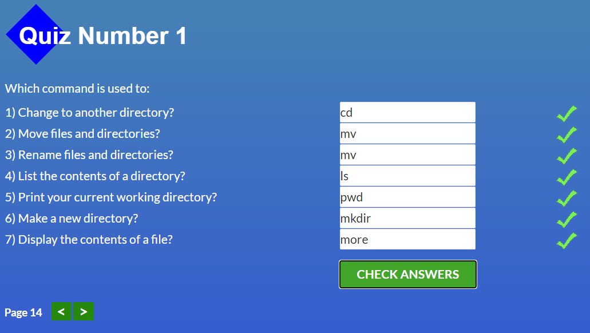

# kottans-frontend
This course helped me to remind and structurise knowledge about Git. Also i found that ID number of commit is called SHA.

## Linux CLI, and HTTP

quiz about linux commands was so fun :)

