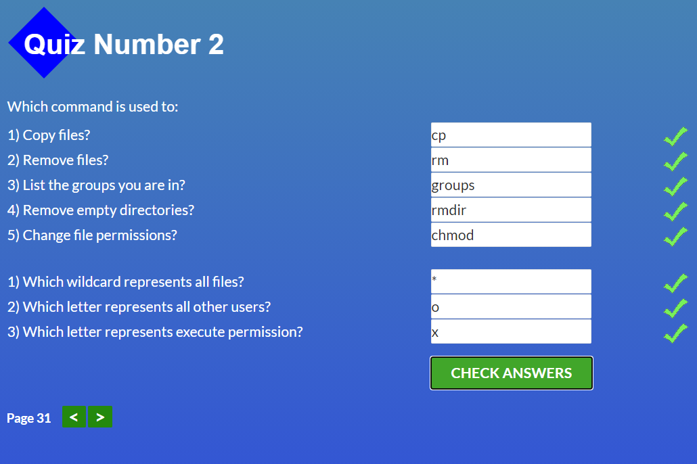
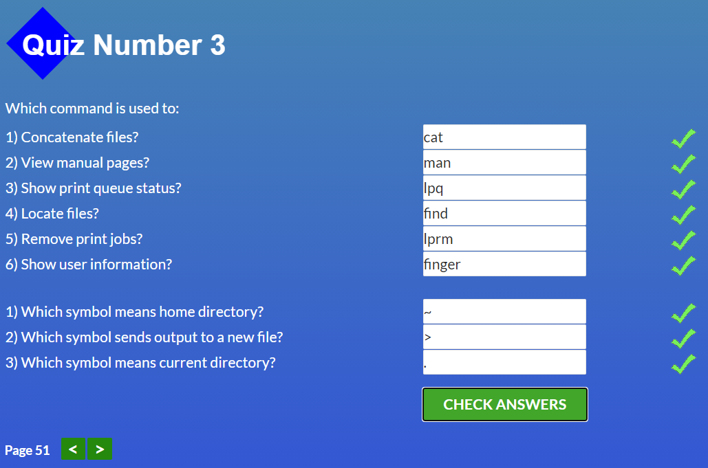
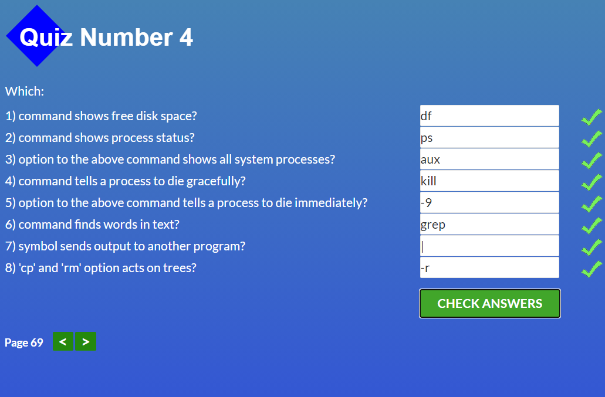

# kottans-frontend

## Linux CLI, and HTTP

quiz about linux commands was so fun :)

I liked Linux Survival course. I knew and used some commands before, but cat, man, lpr and kill commands were new to me and it was interesting to use it.

## Git Collaboration

I didn't use Git in my work before, so it was interesting to learn all these git commands, create repository and work with it.